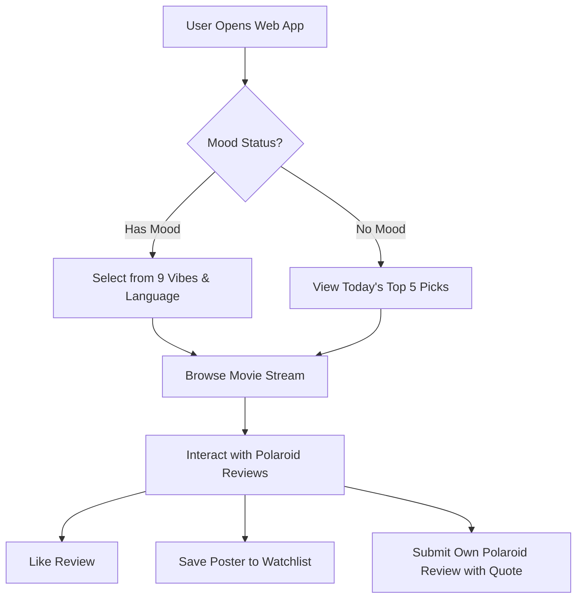

# Movie Vibe — Phase 2: Empathy & User Experience Modeling

## 1. Aesthetic Identity & Creative Direction
**Movie Vibe** combines an all-genre cinematic scope with a nostalgic **Polaroid & Film-Strip Editorial Aesthetic**. Every movie recommendation and community review is treated like a curated film snapshot, featuring high-resolution scene stills paired with iconic dialogues.

---

## 2. The 9-Vibe Taxonomy Framework

| Vibe Category | Emotional Mindset | Aesthetic Visual Cue | Sample Dialogue / Scene Vibe |
| :--- | :--- | :--- | :--- |
| 🛋️ **Comforting** | Seeking warmth, safety, familiarity | Soft lighting, vintage hues | *"It's only after we've lost everything..."* |
| ⚡ **High Energy** | Adrenaline, excitement, motivation | Neon lights, fast motion | *"Why so serious?"* |
| 🌙 **Low Energy** | Unwinding, quiet introspection | Minimalist monochrome, rain | *"We accept the love we think we deserve."* |
| 👨‍👩‍👧‍👦 **Family Time** | Shared laughter, wholesome stories | Warm golden hour, animation | *"To infinity and beyond!"* |
| 💌 **In the Mood for Love** | Romance, longing, passion | Deep reds, intimate closeups | *"If you're a bird, I'm a bird."* |
| 😂 **Hilarious** | Stress relief, pure comedy | Bright saturated tones | *"You can't handle the truth!"* |
| 🥂 **Weekend Vibe** | Celebration, escapism, casual fun | Sunset tones, party scenes | *"Carpe diem. Seize the day, boys."* |
| 🌿 **Refreshing** | New perspectives, indie, uplifting | Natural greens, open landscapes | *"Life moves pretty fast..."* |
| 🍿 **Horror / Thriller** | Suspense, dark intrigue, chills | High contrast shadows, dark blues | *"Here's Johnny!"* |

---

## 3. User Personas & Empathy Mapping

### Persona A: "The Indecisive Binger" (Anya)
* **Goal**: Wants to find a great movie matching her exact Friday night mood in under 2 minutes without scrolling endlessly.
* **Pain Point**: Decision paralysis on traditional streaming apps.
* **Movie Vibe Solution**: Instant 1-click **Vibe Selector** + **Language Filter**, with **Today's Top 5 Picks** fallback.

### Persona B: "The Scene Curator" (Rohan)
* **Goal**: Wants to collect iconic dialogues and aesthetic movie stills, sharing his 5-star "Vibe Check" with a cinephile community.
* **Pain Point**: Text-only review platforms (like IMDB) lack visual aesthetic and emotional resonance.
* **Movie Vibe Solution**: **Polaroid Review Cards** featuring movie stills, iconic quotes, 5-star vibe rating, and like counts.

---

## 4. Polaroid Community Review Component Spec

```
+-------------------------------------------------------+
|  [ MOVIE SCENE STILL / PHOTO ]                         |
|                                                       |
|  "Famous dialogue or quote goes here..."              |
|  - Movie Title (Year) [Language Tag]                  |
|                                                       |
|  Vibe Check: ★★★★★ (5/5 Stars)                        |
|  Reviewed by @user_handle  |  ❤️ 142 Likes           |
|  [+ Add Poster to Watchlist]                          |
+-------------------------------------------------------+
```

---

## 5. End-to-End User Experience Flow


